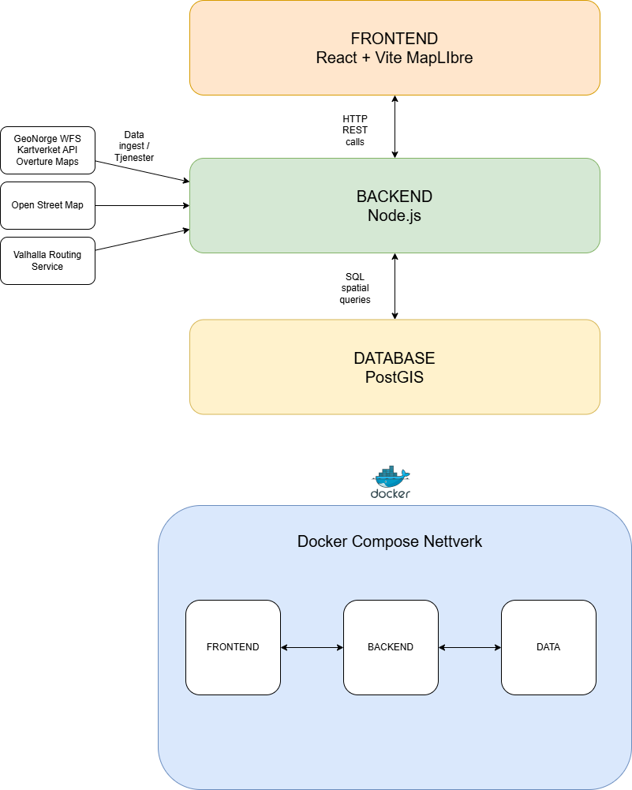

# Beredskapskart (Gruppe 4)


## Problemstilling

Hvordan kan et digitalt kartbasert system utvikles for å hjelpe befolkningen med å finne nødvendige ressurser i krisesituasjoner?

## Prosjektnavn & TLDR: 

2026 er utpekt som totalforsvarets år og dette systemet visualiserer tilfluktsrom, befolkning og beredskapsdata på kart for å støtte evakuering og krisehåndtering.
Brukere kan analysere kapasitet, finne nærmeste tilfluktsrom og utforske geografiske data i sanntid.
Applikasjonen bruker OpenStreetMap som basiskart, React i frontend og lokal PostGIS i Docker.

Inneholder to sider:
- Administratorside for analyse, kapasitetsberegning, lagstyring og eksport
- Brukerside for geolokasjon, nærmeste tilfluktsrom og ruteforslag

## Demo av system:


## Teknisk Stack: 

- React 18 + Vite
- MapLibre GL
- OpenStreetMap
- Node.js + Express
- PostgreSQL/PostGIS
- Docker Compose
- Valhalla API for rute-veiledning og sporing
- GeoNorge Atom/WMS-kilder

## Datakatalog:

| Datasett       | Kilde    | Format           | Bearbeiding|
|----------------|----------|------------------|------------|
| Tilfluktsrom   | Geonorge | GeoJSON (ZIP)    | Nedlasting → unzip → transformasjon (EPSG:25833 → 4326) → lagring i PostGIS |
| Befolkning     | Geonorge | GML/GeoJSON      | Parsing → filtrering → lagring i PostGIS |
| Fylker         | Geonorge | GeoJSON          | Cache + reprojisering |
| Kommuner       | Geonorge | GeoJSON          | Cache + reprojisering |
| Brannstasjoner | Geonorge | GML (ZIP)        | Nedlasting → GML parsing → lagring i PostGIS |
| Farms          | Overture | GeoJSON     | Nedlasting → parsing → lagring i PostGIS |
| Water Sources  | Overture | GeoJSON     | Nedlasting → parsing → lagring i PostGIS |
| Doctors        | Overture | GeoJSON     | Nedlasting → parsing → lagring i PostGIS |
| Hospitals      | Overture | GeoJSON     | Nedlasting → parsing → lagring i PostGIS |

## Arkitekturskisse: 

 ## Arkitektur:

- `postgres`: `postgis/postgis:16-3.4-alpine`
- `backend`: Node.js/Express API med automatisk data-bootstrap
- `frontend`: React + Vite + MapLibre, servert med Nginx

Ved oppstart:
1. PostGIS startes og initialiseres
2. Backend oppretter skjema/tabeller
3. Backend laster ned geodata fra GeoNorge (Atom/WMS-kilder)
4. Data prosesseres og gjøres klare for visning/analyse
5. Frontend blir tilgjengelig når backend er frisk

## Refleksjon:

## Sider:

### Forside:

- Valg mellom Administratorside og Brukerside
- Egne URL-er: `/admin`, `/bruker` og `/simulate`

### Administratorside:

- Radius-slider for dekningsanalyse
- Løpende tabelloppdatering per tilfluktsrom
- Visning av kapasitet, befolkning i radius og manglende kapasitet
- Eksport til CSV og Excel
- Kartlag med toggles

### Brukerside:

- Geolokasjon av bruker
- Knapp for å følge brukerposisjon
- Ruteforslag til nærmeste tilfluktsrom
- Strategi: nærmeste generelt eller med ledig kapasitet
- Transportvalg: gå/sykkel/bil
- Mobil- og desktopvennlig layout

### Simuleringside:

- Oversikt over kart og alle punkter
- Kan opprette nye falske «live»-brukere
- «Live»-brukerne påvirker antall ledige plasser i sikker sone og tilfluktsrom
- Dette påvirker ruter for mat- og vannfordeling og lar brukeren se om det er ledig plass på ulike lokasjoner.
## API (utvalg):

- `GET /health`
- `GET /api/admin/coverage?radius=1000`
- `GET /api/admin/export/csv?radius=1000`
- `GET /api/admin/export/xlsx?radius=1000`
- `GET /api/routing/nearest-shelters?lon=10.75&lat=59.91&strategy=nearest&mode=walk`
- `GET /api/routing/route?originLon=8.00&originLat=58.15&destLon=8.12&destLat=58.16&mode=car`
- `POST /api/users/:userId/location`
- `GET /api/layers/shelters`
- `GET /api/layers/population`

Ruting:
- Backend bruker Valhalla som primar motor for ruteforing (bade bruker og mock-trucker).
- Hvis Valhalla ikke svarer, brukes OSRM fallback, deretter rett linje som siste fallback.
- Du kan overstyre Valhalla-endepunktet med miljo-variabel: `VALHALLA_URL`.

## Oppstart:

Kjør kun:

```powershell
docker compose up -d --build
```

Deretter:
- Frontend: http://localhost:443
- Backend API: http://localhost:3000

## Google Collab Link for DEL A
Lenke til google collab: https://colab.research.google.com/drive/1oUW47z1zeP80I1mDGadpsudwXjQfep1m?usp=sharing
